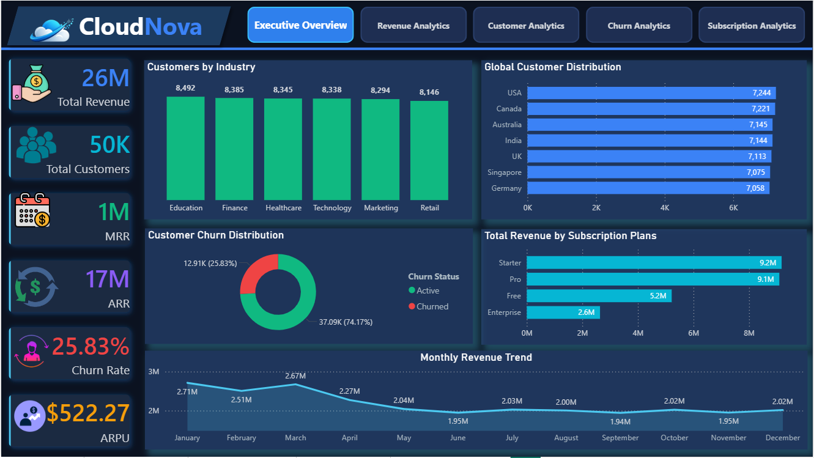
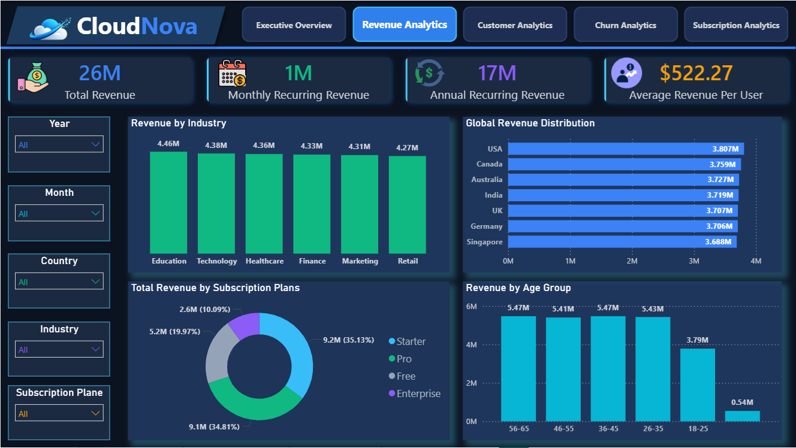
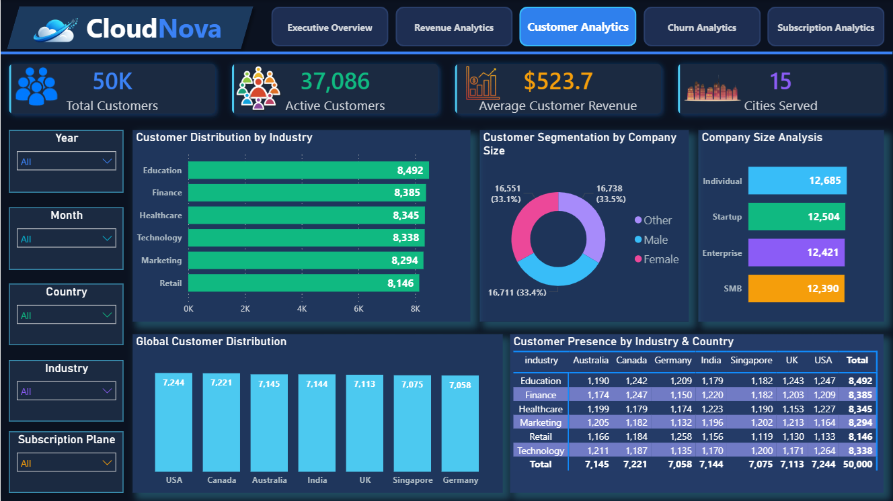
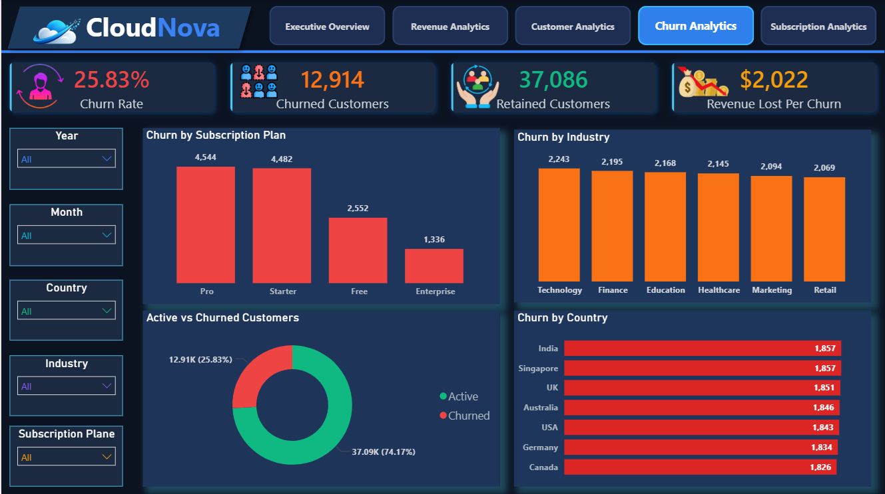
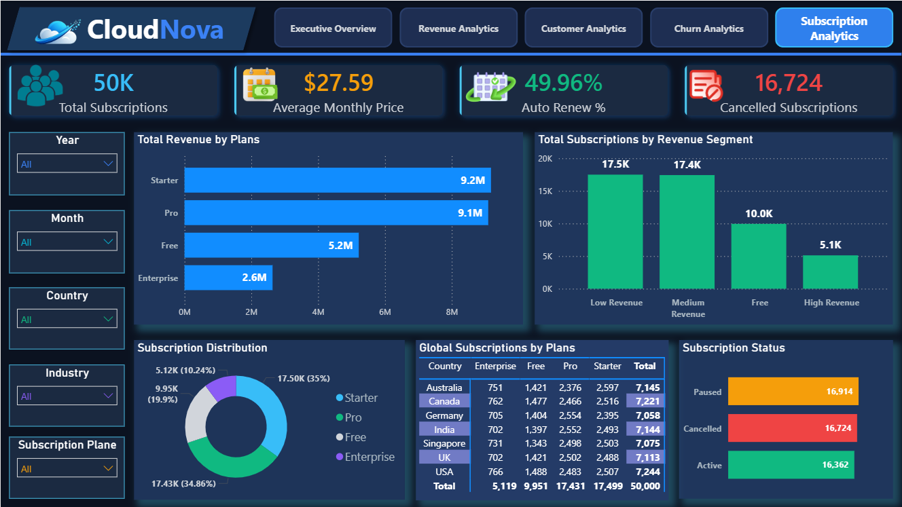
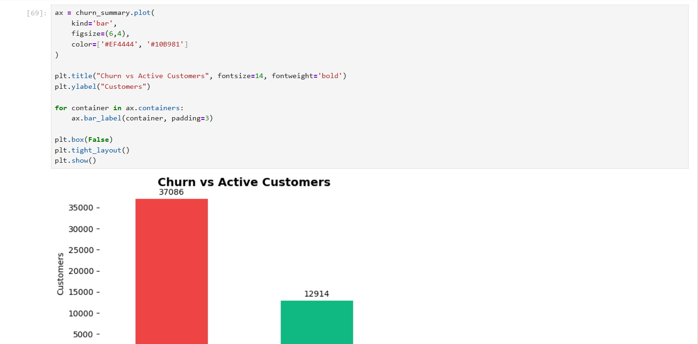
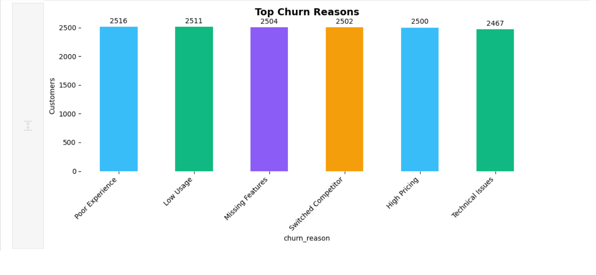
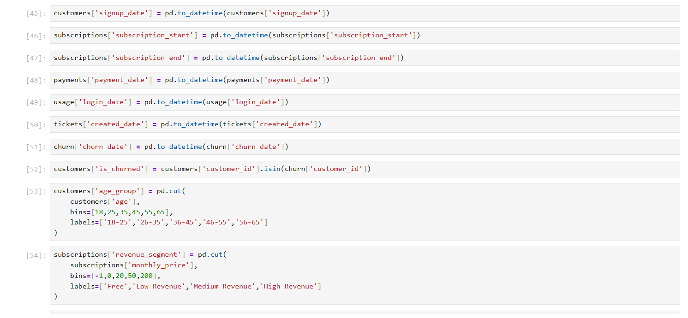

# ☁️ CloudNova SaaS Analytics Dashboard

## 📌 Project Overview

CloudNova is an end-to-end SaaS Analytics Dashboard developed using Power BI, SQL, Python, and DAX.

The project analyzes subscription performance, customer behavior, churn trends, and revenue metrics to support business decision-making.

---

## 🛠️ Tools & Technologies

- Power BI
- Python
- DAX
- Excel

---

## 📊 Key Business Metrics

- Total Revenue
- Monthly Recurring Revenue (MRR)
- Annual Recurring Revenue (ARR)
- Average Revenue Per User (ARPU)
- Churn Rate
- Auto-Renew Percentage
- Customer Lifetime Revenue

---

# 📈 Dashboard Pages

## Executive Overview

Provides a high-level business summary with core KPIs and performance indicators.

---

## Revenue Analytics

Analyzes revenue trends across industries, subscription plans, age groups, and geographic regions.

---

## Customer Analytics

Explores customer demographics, company size, industry distribution, and geographic presence.

---

## Churn Analytics

Identifies churn trends, revenue loss, churn reasons, and customer retention insights.

---

## Subscription Analytics

Tracks subscription status, auto-renew behavior, billing performance, and plan distribution.

---

# 🐍 Python Data Preparation

The dataset was cleaned and transformed using Python before loading into Power BI.

### Data Cleaning

### Customer Churn Analysis

### Top Churn Reasons

### Date & Time Processing

---

# 💡 Key Insights

- Pro and Starter plans contribute the highest share of revenue.
- Enterprise customers generate significantly higher revenue despite lower customer volume.
- Churn rate remains a critical business challenge.
- Auto-renew subscriptions improve customer retention.
- Revenue performance varies considerably across industries and countries.

---

# 🎯 Skills Demonstrated

- Data Cleaning & Transformation
- Exploratory Data Analysis (EDA)
- Data Modeling
- DAX Measures
- Dashboard Design
- Business Analytics
- Data Visualization

---

## 👨‍💻 Author

**Sneh Parekh**

Power BI | SQL | Python | Data Analytics | Business Analytics
